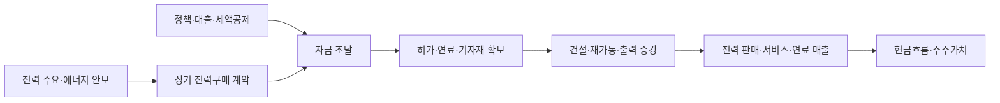

# 미국 원전 투자 리서치
> **정책이 돈으로, 돈이 계약으로, 계약이 실제 발전과 이익으로 이어지는지를 추적합니다.**
>
> 조사 기준일: **2026-09-10 · 한국시간** | 한국어 | 공개 1차 자료 중심 | 수동 갱신 자료

## 먼저 읽을 결론

**미국 원전 투자는 하나의 시장처럼 보이지만, 기존 발전소의 전력 판매·재가동·대형 신규 원전·소형모듈원전·연료 및 기자재로 나누어 봐야 합니다.** 각 분야는 계약 구조와 현금이 들어오는 시점이 다릅니다. 이 저장소는 산업에 투자되는 돈과 관련 기업에 대한 주식투자 관점을 함께 정리합니다.

정책 방향은 분명합니다. 미국 에너지부는 2050년 원전 설비를 약 100GW에서 **400GW**로 늘리는 목표를 설명하고 있습니다. 하지만 정책 목표를 확정 건설량으로 읽어서는 안 됩니다. [S01 DOE](https://www.energy.gov/ne/articles/one-year-after-executive-orders-us-nuclear-energy-renaissance-full-swing)

실제로 가까운 사업 진전을 보여주는 사례도 있습니다. 팰리세이즈는 2026년 8월 30일 연료 장전 절차 개시를 발표했고, 두산에너빌리티는 8월 14일 테라파워 초도호기의 핵심 기자재 제작 계약을 발표했습니다. **연료 장전은 상업운전 완료와 다르고, 기자재 수주는 이익 확정과 다릅니다.** [S09 Holtec](https://holtecinternational.com/hh-47-17/) · [S16 두산에너빌리티](https://www.doosanenerbility.com/kr/about/news_board_view?id=21000822&page=1&pageSize=9)

### 전체 지도

이 그림은 경제적 연결을 설명하는 개념도입니다. 현실에서는 계약·허가·자금 조달이 병행되거나 순서가 달라질 수 있습니다.

| 구분 | 무엇을 보는가 | 중요한 질문 |
|---|---|---|
| 기존 원전 | Constellation·Vistra·Talen | 전력구매 계약이 발전량과 판매단가에 어떻게 반영되는가? |
| 재가동 | Crane·Palisades | 남은 검사와 시험, 재가동 비용은 얼마인가? |
| 대형 신규 원전 | Westinghouse 공급망 | 조건부 금융이 실제 집행·발주로 전환되는가? |
| 소형모듈원전(SMR) | NuScale·X-energy·Oklo·TerraPower·Kairos | 설계·사업장 허가·연료·최종 투자결정 중 무엇이 남았는가? |
| 연료·기자재 | Centrus·Cameco·BWXT·두산에너빌리티 | 계약 물량과 이익률, 생산능력이 함께 늘어나는가? |

위 기업 분류는 [기업별 분석](docs/03-companies.md)의 출처 기반 사업 연관성을 요약한 것입니다. 추천 순위가 아닙니다.

## 읽는 순서

| 문서 | 들어 있는 내용 |
|---|---|
| [01 정책과 자금](docs/01-policy-and-capital.md) | 정부 목표, 800억 달러 파트너십, 175억 달러 조건부 대출, 농축 계약, 세액공제 |
| [02 프로젝트 추적](docs/02-projects.md) | 10개 프로젝트·계약 묶음의 확인된 단계와 다음 확인 항목 |
| [03 기업별 분석](docs/03-companies.md) | 사업별 노출, 수익 구조, 평가 지표, 개발기업의 위험 |
| [04 한국 공급망](docs/04-korea-supply-chain.md) | 두산에너빌리티·현대건설과 미국 원전 사업의 연결 |
| [05 위험과 시나리오](docs/05-risks-and-scenarios.md) | 공사비·금리·희석·연료·대체 전원·정책 위험 |
| [06 점검표와 용어](docs/06-monitoring-and-glossary.md) | 업데이트 절차, 투자 전 질문, 쉬운 용어 풀이 |
| [출처 목록](SOURCES.md) | 24개 출처와 날짜·자료 한계 |
| [조사 방법](METHODOLOGY.md) | 확정 사실과 회사 목표 구분, 중복 합산 방지 |
| [구조화 데이터](data/projects.json) | 다시 활용할 수 있는 프로젝트 데이터 |

## 해석할 때 지킬 세 가지

1. **금액을 무조건 더하지 않습니다.** 투자 구상·조건부 대출·정부 계약·전력구매 금액은 다른 개념이며 같은 사업을 중복 지원할 수 있습니다.
2. **용량을 무조건 더하지 않습니다.** 기존 발전량 확보와 신규 설비 증가가 섞여 있습니다. GW는 설비·계약 전력의 크기이고 실제 발전량은 아닙니다.
3. **산업 성장과 주식 수익률을 구분합니다.** 미래 성장이 이미 주가에 반영되어 있거나, 자금 조달 과정에서 기존 주주의 지분 가치가 희석될 수 있습니다.

### 자료 범위와 한계

24개 공식 출처를 바탕으로 선정한 주요 사례의 종합 자료입니다. 미국의 모든 원전·계약·공시를 전수 조사한 데이터베이스는 아닙니다. 각 항목의 최신 확인 근거 날짜가 다르며, 조사 기준일이 모든 사업 상태를 그날 확정했다는 뜻은 아닙니다. 현재 주가·목표주가·매수 순위·기업별 전체 재무모형은 포함하지 않았습니다. 프로젝트별로 공개되지 않은 계약단가·이익률은 추정 숫자로 채우지 않았습니다. 자동 업데이트는 설정되어 있지 않습니다.
